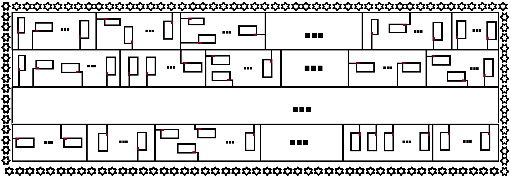
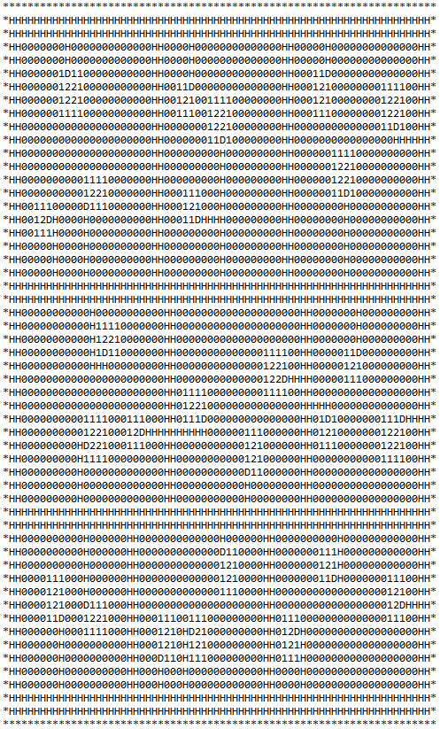
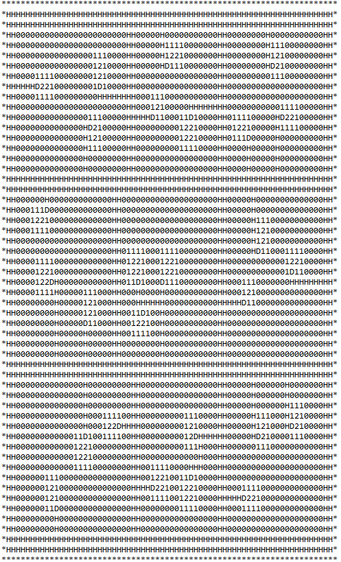
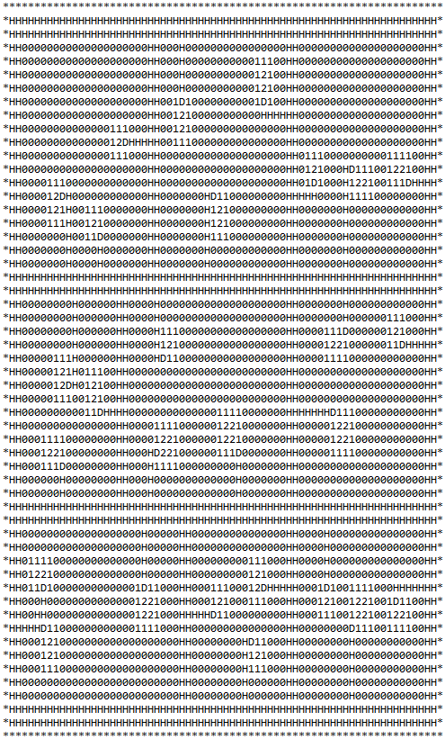

# Procedural-game-map-generation #
Данная работа выполнена в качестве практики во 2-м семестре 3-го курса программы ПМИ в РТУ МИРЭА.

## Основная задача ##
Разаработка модели карты города и реализация её процедурной генерации для каждой новой игрвой сессии.

## Детали реализации ##
Карта должна состоять из параллельных пластов прямоугольных районов (горизонтальные линии районов должны быть параллельны друг другу), в которых есть по несколько домов. От каждой двери дома провести тропинку, идущую к более крупной дороге, окружающей район. Размеры карты, домов, дорог, а также количество районов и домов в них реализовать в виде входных параметров, от которых также зависит генерация.

## Модель карты ##
В общем виде карта будет выглядеть как на Рис. 1 (красным выделены двери домов).

<figure align="center">
  
  <figcaption>Рисунок 1. Общая структура карты города </figcaption>
</figure>

Рисоваться карта будет в текстовом редакторе "Блокнот" и будут использованы следующие обозначения:
* "*" - границы города;
* "H" - дороги (и тропинки, и основные дороги);
* "D" - дверь дома;
* "1" - границы дома;
* "2" - внутренняя часть дома;
* "0" - пустое пространство на карте.

## Парметры модели ##

В качестве параметров для генерации используем:
* height - высота карты в количестве символов без учета границы и дорог;
* heightCount - количество районов в высоту;
* width - ширина карты в количестве символов без учета границы и дорог;
* wideCount - количество районов в ширину;
* roadSize - ширина основных дорог в количестве символов (для тропинок ширина постоянная и равна 1));
* diffPercent - коэффициент искажения размера района относительно среднего размера, вычисленного по формуле $\frac{height}{heightCount}$ или $\frac{width}{wideCount}$ в зависимости от расположения (от 0 до 1);
* housePercent - зависимость количества домов в районе от его размеров (от 0 до 1).

## Результаты ##

Результаты работы для параметров height = 45, width = 60, wideCount = 3, heightCount = 3, diffPercent = 0.25, roadSize = 2, housePercent = 0.33 можно увидеть на Рис. 2.

<figure align="center">
  
  
  
  <figcaption>Рисунок 2. Три разные реализация модели карты для одних и тех же параметров </figcaption>
</figure>
